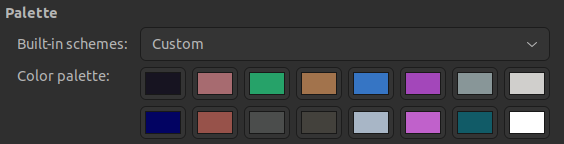

## Outline
- Major reference
- Workflow and SOP
- Minimal examples
- Glossaries
- Raw notes

## major references
- [Udemy course: Vim Masterclass](https://www.udemy.com/course/vim-commands-cheat-sheet/learn/lecture/6606100#overview)
- [Book: Learn Vim the Smart Way](https://learnvim.irian.to/)
- [Vim Reference Guide](https://learnbyexample.github.io/vim_reference/cover.html)
- [Vim Galore](https://github.com/mhinz/vim-galore#completion)

## Workflow & SOP

### SOP: manage plugins with vim-plug plugnin manager

- Install vim-plug follow instuctions, which is different from installing other vim plugins: https://github.com/junegunn/vim-plug
- Add plugins in .vimrc (or init.vim for NeoVim) file

    ```
    " install plugins

    call plug#begin()

    " fuzzy matching file names
    Plug 'junegunn/fzf', { 'do': { -> fzf#install() } }
    Plug 'junegunn/fzf.vim'

    " maximize current window
    Plug 'szw/vim-maximizer'

    " table mode
    Plug 'dhruvasagar/vim-table-mode'

    call plug#end()
    ```

- Source .vimrc and then run `:PlugInstall` to install new plugins.
- `:PlugUpdate` to update plugins
- Read the plugin instructions to properly set options in vimrc.

### SOP: disable highlighting underscore in markdown files
https://github.com/tpope/vim-markdown/issues/21

- make the change in `~/.vim/after/syntax/` or `~/.config/nvim/after/syntax/`.
- create `markdown.vim` in the folder
- add one line to the empty `markdown.vim` file
    ```
    hi link markdownError NONE
    ```
- this new line will overwrite what already in the loaded `markdown.vim` but keep all other settings.

++++++++++++++++++++++++++++++++++++++++++++++++++++++++++++++++++++++++++++++++
++++++++++++++++++++++++++++++++ raw notes +++++++++++++++++++++++++++++++++++++
++++++++++++++++++++++++++++++++++++++++++++++++++++++++++++++++++++++++++++++++
### Vim check settings

Check option setting using `help` `(h)`

- `:set hls?` to check if a `hls` is on
- `:h hls` get document of `hls`. It is a boolean, which can be toggled on and off with `:set hls!`.
- `:h hls` and then `ctr d` to show more command contains keyword "hls". Use tab key make selections. When `wildmenu` is set, use tab key show and select from wildmenu.

set history, default is 50

- `:set history=200`  change to 200
- `:set history&`  change back to default
- `:set history?` check the number of history

### vim crate .vimrc file from scratch

`:e ~/.vimrc`

`:h option-list` to list all options

Skip `:` in `.vimrc` file. After saving, run `:source` to run `.vimrc`.

```
" keep 1000 items in history
set history=1000

" show cursor position
set ruler

" show incomplete commands
set showcmd

" show a list of selections for autocomplete selection
set wildmenu

" display at least 5 rows above or below the cursor if possible
" in normal mode, press z and enter
set scrolloff=5:

" highlight searcch and do incremental search
set hlsearch
set incsearch

" ignore case in search but do not ignore when keyword has capital letters
set ignorecase
set smartcase

" show line number
set number

" auto indent and smart indent
set ai
set si
" remove autoindent when insert #.
" https://unix.stackexchange.com/questions/106526/stop-vim-from-messing-up-my-indentation-on-comments
set cindent cinkeys-=0#

" show existing tab with 4 spaces width
set tabstop=4
" when indenting with '>', use 4 spaces width
set shiftwidth=4
" On pressing tab, insert 4 spaces
set expandtab

" set line break at words when wrapping for long lines
set lbr

" tell the background of the editor so vim can use the
" right hightlight
set bg=dark

" set color scheme, no "set" command used
colorscheme darkblue

" map F1 key to insert #!/bin/bash and Enter and ESC, press fn F1
map <F1> i#!/bin/bash<CR>

" leader key, default to "\", can be changed to ",", use :map to view current mapping
" let mapleader=","
" now ,w equals to :wq
" map <leader>w :wq<CR>

" vmap for mapping in visual mode
" nmap for mapping in normal mode

" Use deoplete.
let g:deoplete#enable_at_startup = 1

call deoplete#custom#option('omni_patterns', {
  \ 'r': '[^. *\t]\.\w*',
  \})

" to disable `_` being automatically replace by `<-`
let R_assign = 0
```

### vim key mapping

Plaxe mapping setting in `.vimrc`. The default mapleader is `\`. Use `:echo mapleader` to check for current mapleader. Show as undefined if default.

```

 38 " map F1 key to insert #!/bin/bash and Enter and ESC, press fn F1
 39 map <F1> i#!/bin/bash<CR>
 40
 41 " leader key, default to "\", can be changed to ",", use :map to view current mapping
 42 let mapleader=","
 43 " now ,w equals to :wq
 44 map <leader>w :wq<CR>
 45
 46 " vmap for mapping in visual mode
 47 " nmap for mapping in normal mode
```

### vim plugins

Check where plugins are saved. Default is `~/.vim/`.

```
:set packpath?
```

### nvim, share vim's .vimrc file and plugins

In `~/.config/nvim/init.vim` file, add

```
set runtimepath^=~/.vim runtimepath+=~/.vim/after
let &packpath=&runtimepath
source ~/.vimrc
```

### vim plugin ale for syntex checking

Asynchronous Lint Engine https://github.com/dense-analysis/ale, which requires `library("lintr")` to run.  To use it

- clone this plugin
- install lintr package in R.

### vim plugin deoplete.nvim for autocomplete and Nvim-R

https://github.com/Shougo/deoplete.nvim#requirements

- check for requirements

- install msgpack package `$ pip3 install msgpack`

- clone this plugin to `start/` and clone for vim only

  - https://github.com/roxma/nvim-yarp
  - https://github.com/roxma/vim-hug-neovim-rpc.git

- inside neovim call `:UpdateRemotePlugins`

- add this to init.vim or .vimrc

  ```
  " Use deoplete.
  let g:deoplete#enable_at_startup = 1
  call deoplete#custom#option('omni_patterns', {
    \ 'r': '[^. *\t]\.\w*',
    \})

  " to disable `_` being automatically replace by `<-`
  let R_assign = 0
  ```

### vim insert multiple dashes, multiple lines start with `#`

From normal mode,

- to insert 10 `-` at the cursor, use `10i->Esc>`, it will create `----------`

- to create 3 lines starts with `##` below cursor, use `3o##<Esc>`

  ##

  ##

  ##

### vim `c` is more like `d`

- `cw` change a word
- `c^` change from line beginning
- `c$` or `C` change till line end
- `cc` change whole line

### vim `~` toggle between lower and uppcase, `U` for upper case, `u` for lower case

- swap cases of one letter, press `~`
- swap cases of one word, `g~w`
- swap cases of one line, `g~~`
- change a word to upper case: `gUw`
- change a line to upper case `gUU`
- change a word to lower case: `guw`
- change a line to lower case `guu`

### vim join two or more lines

- `J`, a space will be added in between
- `gJ`, no space added
- `3J` join three lines

### vim navigation, page, word,

- page down `<ctr>f` forward
- page up `<ctr>b` backward
- `b` and `w`, treat punctuation as words
- `B` and `W`, ignore punctuation
- `e` end of current of word
- `3gg` or `3G`, or `:3` to go to line 3

### vim delete x, X, d, D, s, S

- x under cursor, X left of cursor
- D till the end of line
- s delete one character and enter insert mode
- S delete line and enter insert

### vim getting help `:h`

- `:h dd`help for normal command
- `:h s`
- `:h :wq` help on line command
- `:h count`  help for option
- `:h ^f` check help history, ^ represents `<ctrl>` key.
- `:h ^w^w`, help for `<ctrl>ww`
- In a help document, place cursor on a special word and press `<ctrl>]` to go to the help of that word

### vim `<ctrl>i` `<ctrl>o` to move to next and previously opened file

### vim: register, default (unnamed), named, numbered

delete and copy command like `c` ,`d` `s`, and `y` store text in unnamed register.

- `:reg` view register
- `"3p` to put content in register `"3`
- `"_` black hole register not shown in  the list
- yanked placed in `"0`
- `"a3dd` to delete 3 lines into `"a`.
  - `"A2yy` append 2 lines to register `"a` using capital letter.
- `:reg a` to check content of register a.
- `:reg ac` check registers a and c
- `"a2p` put register a twice

### vim search find replace, `f`, `F`, `;`, `,`,  `/`, `?`, `*`, `n` `N`,

**in normal mode, `;` and `,` repeat last search in line. `n` and `N` repeats last search in document.**

Search is also a motion. So it can be combined with operators.

search **by line** and delete

- `fx` Search in the line for character x after cursor and move cursor to the character. Press `;` to repeat the search and move, `,` in reverse direction
- `Fx` search backward before cursor
- `tx` put cursor before x, useful when combined with d to delete from cursor till x.
- `dtx` delete from current cursor till x (not include)

search **in document** and replace

- `/abc` search `abc`, `<enter>` to confirm, `n` for next `N` for previous
- `?abc` default to backward search
- `*abc` match by whole word `abc` at cursor
- to replace selected `abc` with `ABC`, search for `abc` with `/abc`, press enter, then use `cwABC` to replace `abc` with `ABC`. Then press `<Esc>` to back to normal mode and `n` move to next `abc`  and press `.`, which represent last command `cwABC`.
- `*` on a word to search for a word. Place cursor on a word and press `*`.
- `#` on a word to search for it, but place the cursor at the last occurance.
- `:%s/aaa/bbb/g` replace all `aaa` with `bbb` in the whole file. `%` represent the whole file.
- `:%s/aaa/bbb/gc` confirm at each substituion.

### vim text size `<ctrl> -` to reduce text size, `ctrl shift +` to increase size. resize split windows, `:resize +100`, `:vertial resize - 100` for horizontal and vertical split.

- `:resize 100` set to 100 character
- `:vertical resize 100` set vertical split window size to 100 character
- `:split file1` split current window into top and bottom part
- `:vsplit file1` split current window into left and right part
- `:only` close all other split windows but keep current one.

### vim text object, word, sentence, paragraph, inside bracket,

`{operator}{a}{motion}` or `{operator}{i}{motion}`

**Word**:

- `daw` delete a word, no matter where the cursor is on the word. `dw` delete from cursor to the end of a word.
- `diw` delete a word only, not include space.

**sentence**:

- `das` delete whole sentence
` `dis` delete sentence but keep space after the sentence.

**paragraph**:

- `dap` delete a paragraph
- `dip` not include blank line after the paragraph.

**inside bracket**

- `da]` delete [aaa bbb] when cursor is inside
- `di)` delete text inside `(aaa bbb)`
- `ci>` change inside <aaa bbb>

**tag like `<p> aaa bbb </p>`**

- `cit` change content inside tag.

**quote " ' or back tick**

- `ci"` change "aaa bbb" inside quote.

### vim line range, `%` for whole file, `3,9` line 3-9, `.,$` till end from current position.

- `:3,9 normal dd` delete line 3-9. normal for going back to normal mode as dd is a command in normal mode.
- `:.,$ normal @c` apply macro `c` from current position to the file end.
- `:13,18 s/aaa/bbb/g` replace `aaa` with `bbb` in line 13-18. Do not go back to normal mode as substituion is in command line mode.

### vim macros

Macros are used to repeat a series of commands. Macros are named with single letter from a to z. To create a macro `a`, type `qa` followed by commands and ended with `q`. The macro `a` is in the register and can be viewed with `:reg a`. Its content can be put (pasted) in normal mode with `"ap`.  To use the macro, type `@a`, or `@@` for the last macro in normal mode. Best practices:

- normalize cursor position at line beginning by typing `0` as the first command.
- perform other edits and operations
- position cursor to next line with `j` for easy replays as the last command.

Once a macro is defined, it is used just like any other command in normal mode. It can be used in **other** macros.

Application exemple: convert lines into comments by recording `qc0i# <esc>jq`. To comment out next five lines, type `5@c`.

Macros can be edited to include additional commands. It can also be saved to file or `.vimrc` file.

```
" define a macro that comments out a line.
" Note that `^[` is not typed in from keyboard.
" They are input by pressing keyboard `ctrl v` and `ctrl Esc`.
" or put the macro with register in normal mode `"cp`
let @c = '0i# ^[j`
```

### vim visual mode, v, V, ctrl v

characterwise visual mode, v

- `o` switch cursor between head and end of selected block.The new motions expand or shrink selection from the cursor.
- `vas` visual a sentence.
- `vap` visual a paragraph. A paragraph is a set of lines separated by an empty line.
- `gv` resume last visual selection.
- you can do operations on highlighted text, such as upper case and low case change, or change and delete on the whole block.

linewise visual mode, V

blockwise visual mode, ctrl v
- select all lines into blockmode, using `$` to include the longest line.
- to append to the end of each line of the block, using `A`
- to insert at the beginning of each line, using `I`
- appending and inserting in this way do not work in line mode.

### vim indent code lines with `>` and `<`, trouble in comment section starting with `#`

`>` is to indent by `shiftwidth`, which can be `set shift=4` in `.vimrc` file.

- To indenet single line, use `>>`.
- To indent a text object, use `>i}` for object inside `{}`.
- To indent a block of lines, select in visual mode and press `>`.

Trouble in comment lines. The operation may fail in commented lines. If this happens, check the auto indent setting with `:verbose set autoindent? smartindent? cindent? cinkeys? indentexpr?` and looking for `cinkeys=`. If `0#` is in the list, remove it in `.vimrc` with `set cindent cinkeys-=0#`.

### `.vimrc` file

- `:version` to check where the `.vimrc` files are stored. As a user, we will edit user vimrc, which is `$HOME/.vimrc`.

### vim buffers, text in memory

- `$ vim file1 file2`, `$ vim file\*`, open multiple files.
- `:buffers`. or `:ls`, view buffers.
- `:b2`, where 2 is the second buffer or `:b file2`, open a buffer.
- `:bn`, next buffer
- `:bp`, previous buffer.
- `ctrl ^`, (key 6) switch between two buffers. previous opened buffer
- `:qall!` abadom changes in all buffers and quit
- `:wall` save changes in all buffers.
- `:bd 3` delete buffer 3.
- `:badd file9` add file9 to buffer
- `:1,3bd` delete buffer 1,2,3
- `:%bd` delete all buffers
- `:bufdo %s/aaa/bbb/g | w` openrating on all buffers and save
- `:bufdo %s/aaa/bbb/g` will work if `:set hiddeen` to skip the saving.
- `:bufdo normal u` undo changes to all buffers.
- `:E` to open a list of files as a buffer and select a file to open into buffer. `:bd` to close current buffer.

### vim working with multiple windows

- `:sp` open two windows for the same file and edit at different places.
- `:split file9` open another file
- `:vs file6` vertical split
- `:windo %s/aaa/bbb/g` oporate on all windoes.

### vim gvim clipboard copy paste

- Only works in gvim???????????
- install vim-gtk may allow terminal vim to access clipboard in register ```"*``` and `"+`

### vim stop italics when type stars

- here is a function to be put in `,vimrc` to stop italics (https://gist.github.com/mattn/3f43125df1020fada9b6):

    ```
    function! s:disable_italic()
        let his = ''
        redir => his
        silent hi
        redir END
        let his = substitute(his, '\n\s\+', ' ', 'g')
        for line in split(his, "\n")
          if line !~ ' links to ' && line !~ ' cleared$'
            exe 'hi' substitute(substitute(line, ' xxx ', ' ', ''), 'italic', 'none', 'g')
          endif
        endfor
    endfunction

    command! DisableItalic call s:disable_italic()
    ```

- [ ] why the function only works when run `:so ~/.vimrc`, instead of at opening a file?
- [ ] vimscript tutorial: Learn Vim the Smart Way https://learnvim.irian.to/

### vimscript Ex mode with Q

Ex mode is an extended command-line mode in which we can write commands contineously. To exti Ex mode, type `:visual`.

### vimscript data types

- https://learnvim.irian.to/vimscript/vimscript_basic_data_types

- number are integers
    - `:echo 5/2`   # return 2 instead of 2.5

- float
    - `:echo 5.0/2` # return 2.5

- gtruthy and falsy
    - 0 is falsy and any other vlaues are truthy

- string
    - string concatination
        ```
        :echo "abcd"
        :echo "Hello" . "world"   # string concatination by dot "."
        ```
    - coerce string to integer
        ```
        :echo "12 cats" + 3       # return 15, "12 cats" coerced to 12
        :echo "cats 12" + 3       # return 3 as "12" is not at the bebinning of the string.
        :echo "12.3 cats" + 3     # return 15, coerced to integer only
        ```
    - coerce number to string
        `:echo 12 . "donuts"`       # return "12donuts", dot for concatination
    - string conditionals
        ```
        :if "12cats"              # true as coerced to 12
        :if "cats12"              # false as coeced into 0
        ```
    - double quote vs single quote: string split
        ```
        :echo "hello\nworld"      # return "hello" and "world" in two lines
        :echo 'hello\nworld'      # return the raw string "hello\nworld" in one line
        ```
    - string functions
        ```
        :echo strlen("abcd")      # return 4, string length
        :echo str2nr("12 cats")   # coerced to integer 12
        :echo str2float("12.3cats") # coerced to float 12.3
        :echo substitute("sweet", "e", "o", "g")  # return "swoot"
          # "e" replace by "o". "g" flag all "e" to be replaced
        :echo substitute("sweet", "e", "o", "")   # returns "swoet"
          # flag is empty, only first "e" replaced by "o"
        :echo getline(5)          # return text in line 5 of the file.
        :echo substitute(getline(5), "e", "o", "g")  # replace all "e" with "o" in line 5.
        ```
    - string slicing
        ```
        :echo "abcd"[0]   # return the first character "a"
        :echo "abcd"[1:2] # return "bc", second to third characters
        ```

- list, `:h list-functions` to view all list functions.
    - list subset
        ```
        # like python list, [1, 2, 3], ["a", "b", "c"], [1, "a"], [1, 2, [3, 4]]
        # first index is 0. element accessed with [i]
        :echo [1, 2, 3][1]    # return 2, the second element
        :echo [1, 2, 3][-1]   # return 3, the last element
        :echo [1, 2, 3, 4][1:2]  # return [2, 3], including index 2, which is different from python.
        ```
    - list concatination
        ```
        :let lst_a = ["a", "aa"]
        :let lst_b = ["b", "bb"]
        :echo lst_a + lst_b       # return ["a", "aa", "b", "bb"]

        :let lst_a = ["a", "aa"]
        :let lst_a += ["aaa"]
        :echo lst_a           # return ["a", "aa", "aaa"]
        ```
    - list functions
        ```
        # list length
        :echo len(["a", "aa"])  # length 2
        :let a = ["a", "aa"]

        # insert an element
        :call insert(a, "aaa")  # insert as the first element
        :echo a                 # return ["aaa", "a", "aa"]
        :call insert(a, "aaaa", 2)  # insert at index 2 of a
        :echo a                 # return ["aaa", "a", "aaaa", "aa"]

        # remove an element
        : call remove(a, 2)    # remove 3rd element

        # filter element by string. v:val is a specical variable in vim for iterating through a list or a dictionary using function filter and map
        :let lst = ["abc", "defg", "xyz"]
        :call filter(lst, 'v:val !~ "ab"')   # filter element that do not contain "ab"
        :echo lst     # return ["defg", "xyz"]

        # map a function to each element
        :call map(lst, 'v:val . "_end"')    # append end to each element by function dot "."
        :echo lst    # return ["defg_end", "xyz_end"]
        ```

    - list unpacking
        ```
        # assign each element to a variable
        :let lst = ["aaa", "bbb", "ccc"]
        :let [a, b, c] = lst
        :echo a     # return "aaa"
        ```

    - modify a list elements
        ```
        :let lst[1:2] = ["yyy", "zzz"]  # change second and third element to ["yyy", "zzz"]
        ```

- dictionary, very similar to python dictionary, for more see https://learnvim.irian.to/vimscript/vimscript_basic_data_types or `:h dict-functions`.
    ```
    # dictionary key are strings or coered to strings from numbers
    :let dict = {1 : "first", "2" : "second"}
    :echo dict    # return {'1': 'first', '2': 'second'}

    # use #{} to save typing double quote on keys
    :let dict = #{a : "aaa", b : "bbb"}
    :echo dict    # returns {'a': 'aaa', 'b': 'bbb'}
    ```

- vim special primitives
    - v:false, equivalent to 0
    - v:true, equivalent to non-zero number
    - v:none, equivalent to empty string ""
    - v:null

### vimscript conditionals and loops

- https://learnvim.irian.to/vimscript/vimscript_conditionals_and_loops

- special string operators
    - `stra =~ strb`, stra contains strb
    - `stra !~ strb`, stra does not contain strb.
    - `stra !~# strb`, use "#" to alway match case, even `set ignorecase`.
    - `stra =~? strb`, use "?" to always ignore case.

- common logic
    - if ... else ... endif
    - for ... endfor
    - while ... endwhile
    - break to break loop
    - continue to continue loop
    - try, finally, and catch

- ternary expression
    - `let &background = strftime("%H") < 18 ? "light" : "dark"`. This expression set vim background based on current time. First it checks if it is before 6pm with `strftime("%H") < 18 ?`. If true takes value "light" otherwise "dark". Pay attention to the question mark "?".

### vimscript variable scopes

- mutable and immutable varaibles
    - `let a = "aaa"` defines a mutable varaible, which can be changed with `let` later on.
    - `const c = "ccc"` defines a immutable varaible, which cannot be changed.

- variable sources
    - environment variable like `$SHELL` and `$HOME` from linux.
    - optional variables like `&background` of vim
    - register varaibles like `@a` in vim regester.

- variable scopes
    ```
    # global variables, start with g: or nothing
    let g:x = 123  # or let x = 123

    # buffer variables start with b:, only accessible to the buffer.
    const b:y = "abc"

    # window varaible start with w: and only availble to the window
    let w:z = 3.14

    # tab varaible start with t:

    # script variable start with s: and is only used in the script

    # build-in vim varaibles, start with v:
    v:version, vim version
    v:key, current dictionary key in iteration
    v:val, current element value in list
    v:true, v:false, v:none, and v:null
    ```

### vimscript function
https://learnvim.irian.to/vimscript/vimscript_functions

- define a function
    ```
    # start with capical letter
    function Myfunction()
        {do sth}
    endfunction

    # use ! to overwrite a function with the same name
    function! Myfunction()
        {do sth else}
    endfunction

    # use s: if really want to start function name with lower case letter
    function s:myfunction()
        {do anything}
    endfunction
    ```

- check for functions
    - `:function` to see a list of all functions, custom or built-in
    - `:function Myfunction` to view the definition of the function
    - `:function /abcd` search for function whose name contains "abcd"
    - `:verbose function /abcd` check for the source file of function containing "abcd"

- function formal arguments with `a:` variable scope
    ```
    # a: is required to set the scope of the argument
    function! Tasty(food)
        return "Tasty " . a:food
    endfunction
    ```

- function local variable with `l:` scope. Vim has special variables like "count". If you do not use `l:count` to specify the scope, there will be an error, as you are trying to redefine a vim built-in variable.
    ```
    function! Localfun()
        let l:aaa = "abcde"
        return "Function name is " . l:aaa
    ```

- call a functon
    - use function `call()`. All formal arugments are placed in a list.
        ```
        call("Myfunction", [arg1, arg2, arg3])
        ```
    - use command-line function `:call Myfunction(arg1, arg2, arg3)` will not return the function return. Good to call functions without return values.

- variable argument `...`, `a:0` for length of `...`, `a:1` the first, `a:2` the second, `a:000` is for all in a list.
    ```
    # one way to work with ... variable argument
    function! Buffet(...)
      let l:food_counter = 1
      let l:foods = ""
      while l:food_counter <= a:0
        # {} for string interpolation.
        let l:foods .= a:{l:food_counter} . " "
        let l:food_counter += 1
      endwhile
      return l:foods
    endfunction

    # a better way is using a:000
    function! Buffet(...)
      let l:foods = ""
      for food_item in a:000
        let l:foods .= food_item . " "
      endfor
      return l:foods
    endfunction
    ```

- function keywords, range, dict,
    - range, allow the function to work in visual mode on highlighted text. By adding "range" to the function definition, two special variables are availble: a:firstline and a:lastline.
        ```
        function! Testrange() range
            echo a:firstline
            echo a:lastline
        endfunction

        # to use this function, select text in visual mode and then
        :call Testrange()
        ```
    - dict, add a function as a dictionary item
        ```
        # define the function with keyword dict
        function! SecondBreakfast() dict
            return self.breakfast    # here self refer to the dictionary that uses the function.
        endfunction

        # use the function in a dictionary
        let meals = {"breakfast" : "pancakes", "second_breakfast" : function("SecondBreakfast"), "lunch" : "pasta"}
        echo meals.second_breakfast    # return "pancakes", as measl.second_breakfast is
                                       # self.breakfast, which is meals.breakfast.

        # an alternative way to add a function into a dictionary is to use a namespace
        function! meals.second_lunch()
            return self.lunch
        endfunction
        echo meals.second_lunch()      # returns "pasta"
        ```

- Funcref, reference to a function, one of vimscript's basic data type. You can assign a function to a variable
    ```
    # define a function
    function! Breakfast(item)
        return "I am haveing " . a:item . " for breakfast"
    endfunction

    # assign the function to a variable by calling function() again.
    let Breakfastify = function("Breakfast")

    # to use a function as reference in map or filter, add "index" as the first argument
    function! Breakfast(index, item)
        return "I am having " . a:item . " for breakfast"
    endfunction
    let breakfast_items = ["pancakes", "hash browns", "waffles"]
    let first_meals = map(breakfast_items, function("Breakfast"))
    for meal in first_meals
        echo meal
    endfor
    ```

- Lambda, the unnamed function
    ```
    # example 1
    let Plus = {x,y -> x + y}
    echo Plus(1,2)  # returns 3

    # example 2
    let Tasty = { -> "tasty"}
    echo Tasty()    # return "tasty"

    # call a functionn from inside a lambda expression
    function! Lunch(item)
        return "I am having " . a:item . " for lunch"
    endfunction
    let lunch_items = ["sushi", "ramen", "sashimi"]
    let day_meals = map(lunch_items, {index, item -> Lunch(item)})
    for meal in day_meals
        echo meal
    endfor

    # or simply
    let day_meals = map(lunch_items, {index, item -> "I am having " . item . " for lunch"})
    ```

- method chaining to chain several functions or lambda expression with `->`
    ```
    function! Capitalizer(word)
        return substitute(a:word, "\^\.", "\\u&", "g")  # "&" backreference to the matched pattern
    endfunction

    function! CapitalizeList(word_list)
        return map(a:word_list, {index, word -> Capitalizer(word)})
    endfunction

    let dinner_items = ["bruschetta", "antipasto", "calzone"]

    echo dinner_items->CapitalizeList()->sort()->join(", ")
    " returns "Antipasto, Bruschetta, Calzone"
    ```

- closure, vim functions use lexical scope but do not allow free variables
    ```
    # This is wrong as appetizer is not available to function SecondLunch
    function! Lunch()
      let appetizer = "shrimp"

      function! SecondLunch()
        return appetizer
      endfunction

      return funcref("SecondLunch")
    endfunction

    # to correct it add "closure" to the function definition
    function! Lunch()
      let appetizer = "shrimp"

      function! SecondLunch() closure
        return appetizer
      endfunction

      return funcref("SecondLunch")
    endfunction
    ```

### vim / neovim: install vim plugin

- install gcc complier if not exists by checking `$ gcc --version`

  ```shell
  $ sudo apt update
  $ sudo apt install build-essential
  ```

- clone the github project to

  -  `~/.vim/pack/anynames/start/` auto-load when vim starts
  -  `~/.vim/pack/anynames/opt/`  manual load with `:packadd xxx`

- for neovim, the default location is

  - `~/.config/nvim/pack/anynames/start`
  - `~/.config/nvim/pack/anynames/opt`

### vim: install vim 9.0

Released on June 2002 and is not available in Ubuntu official package repositories. activate vim.

```shell
$ sudo add-apt-repository ppa:jonathonf/vim
$ sudo apt update
$ sudo apt install vim
```

### vim: install and use Nvim-R package

Easier to install in neovim. May not work in vim.

**Installation**:

https://github.com/jamespeapen/Nvim-R/wiki/Installation

**Use**:

Complete instruction: https://github.com/jamespeapen/Nvim-R/wiki/Use

Nvim-R manual: https://github.com/jalvesaq/Nvim-R/blob/master/doc/Nvim-R.txt

### neovim: quick IDE configuration using kickstart.nvim, ignore for now

https://www.youtube.com/watch?v=stqUbv-5u2s

https://github.com/nvim-lua/kickstart.nvim

**Requirement**: latest neovim.

To install the latest neovim, download deb file from https://github.com/neovim/neovim/releases/nightly. If any error during installation, force installation with

```shell
$ sudo dpkg -i --force-overwrite nvim-linux64.deb
$ sudo apt -f install
```

**Configuration**

copy `init.lua` at https://github.com/nvim-lua/kickstart.nvim to `~/config/mvim/.

start nvim, the configuration will start automatically.

### vim: vertical line at 80

```
set colorcolum=81
hightlight ColorColumn ctermbg=238
```

### nvim colorscheme solarized customized

- clone the files from https://github.com/altercation/vim-colors-solarized
- copy all its content into ~/.config/nvim
- add these to init.vim
    ```
    colorscheme solarized
    set background=dark
    syntax enable
    ```
- open terminal and click on the tree horizontal bar, then preference and Unnamed. Selecct tab Colors.
- under Palette select Solarized built-in scheme
- click on the individual palette to modify the scheme to my eyes
    - the palette is arranged as a 2 x 8 matrix
    - first to change the background to blue, the coloe at (2, 1). Aftet the change, the built-in schemes becomes Custom.
    - change other colors when see fit. Here is the color works so far.
        
- click the downward arrow right to "Unnamed" and select clone to name the clone to "solarized_custom". A menu item named "solarized_custom" will appear next to "Unnamed", which can be set as the default profile.
- to save the Ubuntu terminal profile
    ```sh
    # the profile is not in the form of a file, but can be created as
    dconf dump /org/gnome/terminal/ > ~/OneDrive/computer-configurations/gnome_terminal_settings.txt
    # to load it back
    dconf load /org/gnome/terminal/ < ~/OneDrive/computer-configurations/gnome_terminal_settings.txt
    ```
    Here is the profiles freshly saved `~/OneDrive/computer-configurations`, which include line `visible-name='colarized_custom'`, indicating default profile.
    ```
    [legacy]
    theme-variant='dark'

    [legacy/profiles:]
    default='87bba6e1-97d5-4c41-bf88-adb1570fe0d2'
    list=['b1dcc9dd-5262-4d8d-a863-c897e6d979b9', '87bba6e1-97d5-4c41-bf88-adb1570fe0d2']

    [legacy/profiles:/:87bba6e1-97d5-4c41-bf88-adb1570fe0d2]
    background-color='rgb(23,20,33)'
    bold-is-bright=false
    default-size-columns=90
    default-size-rows=30
    font='Ubuntu Mono 11'
    foreground-color='rgb(208,207,204)'
    palette=['rgb(23,20,33)', 'rgb(167,107,112)', 'rgb(38,162,105)', 'rgb(162,115,76)', 'rgb(54,117,196)', 'rgb(163,71,186)', 'rgb(136,150,152)', 'rgb(208,207,204)', 'rgb(2,3,98)', 'rgb(151,82,74)', 'rgb(75,77,76)', 'rgb(67,65,60)', 'rgb(168,182,198)', 'rgb(192,97,203)', 'rgb(17,91,103)', 'rgb(255,255,255)']
    use-system-font=false
    use-theme-colors=true
    use-theme-transparency=true
    visible-name='solarized_custom'

    [legacy/profiles:/:b1dcc9dd-5262-4d8d-a863-c897e6d979b9]
    background-color='rgb(23,20,33)'
    bold-is-bright=false
    default-size-columns=90
    default-size-rows=30
    font='Ubuntu Mono 11'
    foreground-color='rgb(208,207,204)'
    palette=['rgb(23,20,33)', 'rgb(167,107,112)', 'rgb(38,162,105)', 'rgb(162,115,76)', 'rgb(54,117,196)', 'rgb(163,71,186)', 'rgb(136,150,152)', 'rgb(208,207,204)', 'rgb(2,3,98)', 'rgb(151,82,74)', 'rgb(75,77,76)', 'rgb(67,65,60)', 'rgb(168,182,198)', 'rgb(192,97,203)', 'rgb(51,199,222)', 'rgb(255,255,255)']
    [use system font](use-system-font)=false
    use-theme-colors=true
    use-theme-transparency=true
    ```

### vim syntax hight, /usr/share/vim/vim90/syntax

- reference: `https://arnaudr.io/2020/08/17/modify-vim-syntax-files-for-your-taste/

- These are the system files that affect every users and applicationsl They are not supposed to be modified as they will be overwritten at eadh update.

- The right way is to copy them into `~/.vim/syntax/`  and modify over there. Vim will search in these local files before system files.

- or for small changes, in `~/.vim/after/syntax/`,

### vim disable highlighting underscore in markdown files
https://github.com/tpope/vim-markdown/issues/21

- make the change in `~/.vim/after/syntax/`
- create `markdown.vim` in the folder
- add one line to the empty `markdown.vim` file
    ```
    hi link markdownError NONE
    ```
- this new line will overwrite what already in the loaded `markdown.vim` but keep all other settings.

### Vim table mode

- use plugin vim-table-mode, add `Plug 'dhruvasagar/vim-table-mode'` to .vimrc.
- \tm to start table mode
- First line: use | to seperate column names
- second line type | twice to generate lines
- an exemple
    | name  | city       | state | country |
    |-------|------------|-------|---------|
    | tom   | Providence | RI    | US      |
    | Jerry | Boston     | MA    | US      |
    | pit   | New York   | Ny    | US      |
- add a new column, \tic
- delete a column, \tdc
- delete row, \tdd

